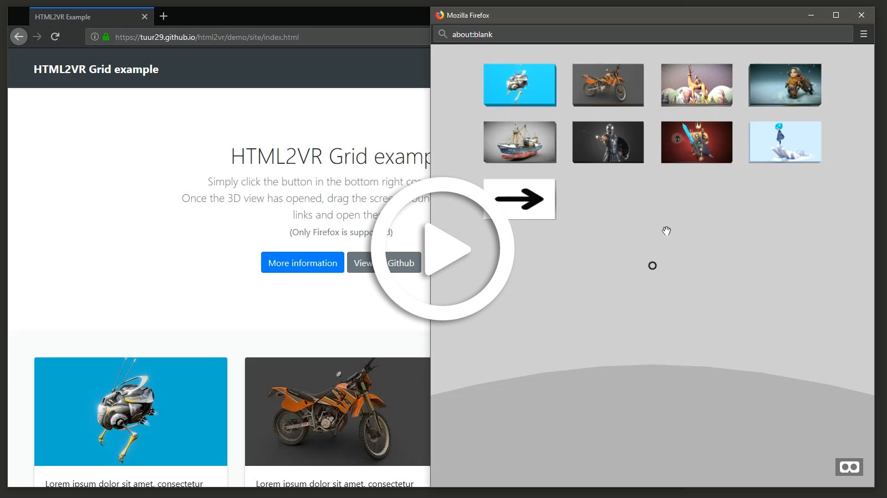

# HTML2VR

html2vr is a native JS library that allows a webdeveloper to easily add a user interface in VR to an existing html page. Think of it as a library like a photo lightbox or a CSS framework.

**Why?** A lot of sites have integrated WebVR ([youtube](https://youtube.com), [sketchfab](https://sketchfab.com)) but none allow you to navigate the site in VR. You always have to go back to the pancake (read: flatscreen) version and open a new link. This library remedies that.

This repo contains 3 modules:

- [**library**](./library): contains the script you can load on your site and documentation

- [**demo**](./demo): a demo site (hosted on github pages) to discover the functionality

- [**extension**](./extension): browser extension that loads this library on some sites like youtube, sketchfab...

> Note: Firefox is currently the only fully supported browser!

---

## [Demo](./demo)

**Test it yourself on the [demo page](https://tuur29.github.io/html2vr/demo/site).**

Or see it in action in the video below:  

## [Library](./library)

You can load this javascript library to easily 'convert' your existing HTML page to a VR environment.  
You can download the [latest release here](https://github.com/tuur29/html2vr/releases).

Find the [documentation here](./library).

## [Extension](./extension)

> Planned but currently not yet in development.

Extensions for Chrome and Firefox that uses the HTML2VR library to generate a VR version.
